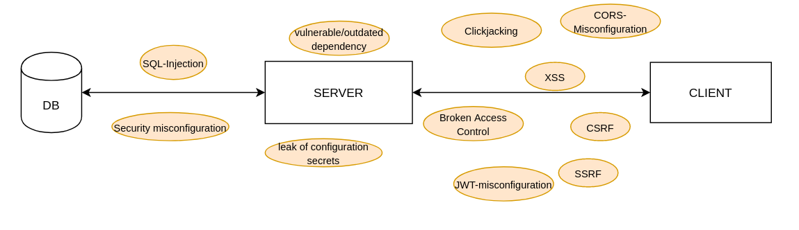
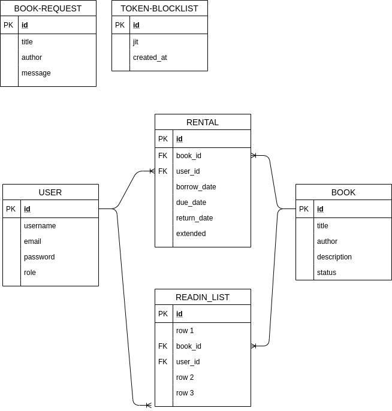

## Setup

Prerequisites: python3, pip

` $ python3 -m venv e`

`$ source env/bin/activate`

`$ pip install -r requirements.txt`

`$ flask --app main run`

The app can be accessed via [localhost:5000](localhost:5000)

## Security Measurements

- Authentication with flask-jwt-extended => token-based, double submit-pattern
- Authorization (user role, admin role)
- Input validation
- Security Headers
- Cookie policy
- HTTPS enforced, TLS certificate provided by pythonanywhere
- Password security
- XSS protection
- CSRF protection
- Server side request forgery protection
- Preventing Cross-origin resource sharing
- SQL Injection protection

## Deployment

The [flask application](emely3h.pythonanywhere.com) is deployed using pythonanywhere. SQLite is also used on production.

## Thread Model

## Features

  All users are able to:
  - view all books in the bookshelf
  - log in
  - register
  - view details of a book
  - make a book request
  
  Logged in users are able to:
  - access the my-books page and view all their borrowed books, their due dates and their reading list
  - borrow a book
  - extend a book if it was not requested by an other user
  - request a book
  - log out
  
  Admin(s) are able to:
  - access the admin page and view all currently borrowed or missing books and the latest book requests
  - add books to the bookshelf
  - remove books from the bookshelf
  - delete a book request
  - return a book
  - mark a book as missing
  - view the renting history of every book

## DB doc

